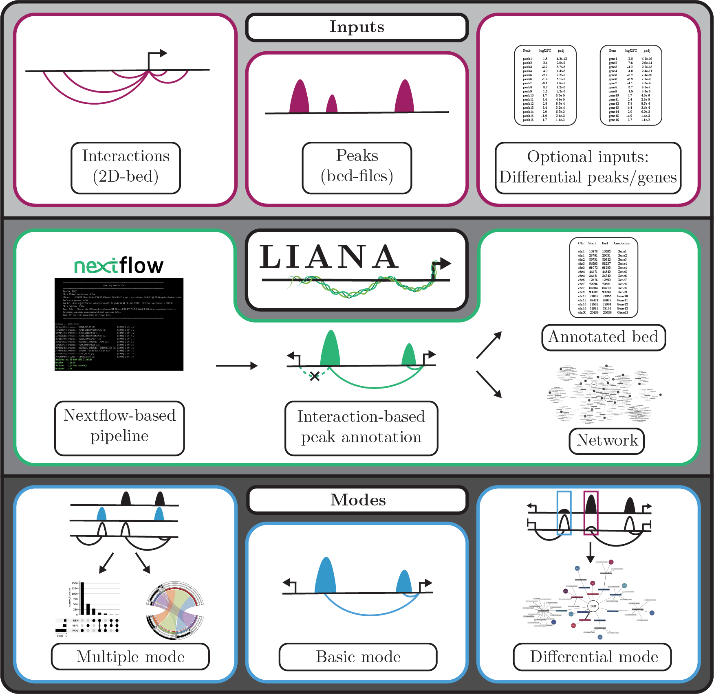

# LIANA: Long-range chromatin Interaction for ANnotation of peAks
**A nextflow-based pipeline to facilitate the use of chromatin interaction for peak annotation**

## Introduction
More and more evidence points towards the importance of chromatin interactions in gene regulation. The amount of available interaction data is steadily increasing and with that the potential to, in cell type specific manner, assigning transcription factor occupancy and epigenetic features to genes (i.e. peak annotation). Despite this, the standard method for linking genomic regions to genes is still proximity annotation. Improvements have been made to the standard proximity based annotation to facilitate annotation of more distal peaks (e.g. GREAT2). However, cell type specific interactions as well as interactions spanning several hundred kbp with other genes located between the promoter and its distal regulatory regions, are still likely to be missed. One reason for the limited use of chromatin interactions in peak annotation could be that it is time consuming and require a certain skill set. LIANA aim to change this by providing an easy-to-use tool that, in a single command, can perform interaction-based annotation of multiple peak files. LIANA was originally developed for PLAC-seq data, but other forms of interaction data in 2D-bed format can be used as well.

LIANA (Long-range chromatin Interactions for ANnotation of peAks) is a nextflow based pipeline that perform peak annotation by combining conventional proximity-based and interaction based annotation. This allows it to improve the accuracy of annotation for distal peaks while still allowing for peaks located promoter regions to be annotated to the corresponding gene. The principal idea for LIANA, is to perform peak-centered annotation, however there are cases where the presence of a transcription factor occupancy or histone modification at the interaction anchor points are of interest. For this LIANA provides the option to perform interaction-centers annotation. LIANA can be run in 3 different modes, all which is provided with the option to visualize the peak annotations in an interactive network format using Cytoscape.



### Annotation modes
To facilitate annotation of different types of input data, the pipeline can be run in three different modes: basic, multiple and differential:

#### Basic mode
The basic annotation mode performs interaction-based annotation of a single peak file. Examples include annotation of ATAC-seq peaks or transcription factor binding from ChIP-seq/Cut&Run. The main output is a text file that for each peak in the input bed file, provides proximity/interaction-based annotation. A gene list, containing all genes that peaks are annotated is also provided. In addition to the peak-centered annotation, it is also possible to perform interaction-centered annotation and visualize the peak annotation in network format using Cytoscape.

#### Multiple mode
In many cases, identification of co-binding between multiple transcription factors could be of interest. For these cases multiple mode is suitable. Multiple mode allow you to simultaneously annotating multiple peak files separately (identical to basic mode). In addition, it provides the option to identify and visualize co-occupancy between the regulators in the form of upset plots and interaction-based circos plots.

#### Differential mode
Differential mode is developed to deal with comparison between two conditions. By providing corresponding gene expression data, peaks associated with changes in gene expression can be identified as well as being categorized as activating or repressive.

## Pipeline summary

The pipeline consist of the following processes:

1. **BED2D_SPLIT** - 2D-bed file is splitted for annotation of the two anchor points separately
2. **ANNOTATE_INTERACTION** - Annotation of 2D-bed anchor points using [`HOMER`](http://homer.ucsd.edu/homer/)
3. **JOIN_ANNOTATED_INTERACTIONS** - Recreating the original 2D-bed interactions with annotations
4. **ANNOTATE_PEAKS** - Annotation of provided peak file(s) using [`HOMER`](http://homer.ucsd.edu/homer/)
5. **SPLIT_ANNOTATED_INTERACTIONS** - Annotated 2D-bed file split for peak intersection
6. **PEAK_INTERACTION_INTERSECT** - Peak-centered intersection of provided peak file(s) with genomic interactions using [`bedtools`](https://bedtools.readthedocs.io/en/latest/index.html)
7. **PEAK_INTERACTION_BASED_ANNOTATION** - Performing interaction-based annotation of provided peak file(s)
8. **INTERACTION_PEAK_INTERSECT [Optional]** - Interaction-centered intersection of peak file(s) with genomic interactions using [`bedtools`](https://bedtools.readthedocs.io/en/latest/index.html)
9. **ANNOTATE_INTERACTION_WITH_PEAKS [Optional]** - Interaction based annotation of 2D-bed file with provided peak files(s)
10. **NETWORK [Optional]** - Creating files for network visualization of peak annotation
11. **NETWORK VISUALIZATION [Optional]** - Visualizes networks using [`Cytoscape`](https://cytoscape.org/)
12. **UPSET_PLOT [Optional]** - Upset plots for overlap of peak files in promoter and distal regions (only available in Multiple mode)
13. **CIRCOS PLOT [Optional]** - Circos plot representing peak overlap in genomic interactions (only available in Multiple mode)
14. **DIFFERENTIAL_EXPRESSION_ASSOCIATED_PEAKS [Optional]** - Finding differential peaks that are associated with changes in gene expression


## Installation

####  Create conda environment:
Download the liana_env.yml file and create a conda environment that contain all packages required to run the pieline:
```bash
conda env create -f liana_env.yml
```
Activate conda environment:
```bash
conda activate liana_env
```
####  Configure HOMER:
Before you use the pipeline, HOMER must be configured correctly. For each genome you intend to use, download the reference fasta file by using the following command (for available genomes visit: http://homer.ucsd.edu/homer):
```bash
perl <path to conda>/envs/liana_env/share/homer*/configureHomer.pl -install <genome (e.g. mm10, hg19)>
```
Next, download the promoter annotations for the organism you are working with (for available organisms visit: http://homer.ucsd.edu/homer):
```bash
perl <path to conda>/envs/liana_env/share/homer*/configureHomer.pl -install <organism-p (e.g. mouse-p, human-p)>
```

####  Launch Cytoscape:
If you want to visualize peak annotation networks, Cytoscape must be installed and launch before running the pipeline. To install Cytoscape, follow the instructions at: http://cytoscape.org. Launce Cytoscape:
```bash
Cytoscape &
```

####  Launch pipeline:
Download the pipeline (including liana.nf & nextflow.config). To avoid having to specify the path to the config file, make sure to place the two files in the same directory. Try to launch the pipeline:
```bash
nextflow run liana.nf --help
```

## Inputs

#### Required input
| Input | Description |
| --- | --- |
| `--peaks` | Path to txt file specifying the name of the peak files(s) in the first column and the path to the file(s) in the second column (For example see: [peaks.txt](example_files/peaks.txt)). The recommended input format for the peak files are 6 column bed files (more columns are allowed but will be ignored): chr, start, end, peakID, peak score, strand. It is also possible to use a 3 column bed but then peakIDs are automatically generated and peak score and strand information are not available. |
| `--bed2D` | Path to chromatin interaction from PLAC-seq/HiChIP/Hi-C (or any similar method that captures long-range interactions) in 2D-bed format with a least 6 columns (chr, start, end for each anchor point) with the option to specify a column for an interactions score (e.g. q-value) with `--interaction_score_column`. The pipeline was originally designed for 2D-bed files created by [`FitHIChIP`](https://github.com/ay-lab/FitHiChIP), and for that reason the default interaction score column is 9 (q-value). This input can be replaced by `bed2D_anno` if an already HOMER annotated 2D-bed file is available and the argument `--skip_anno` is used. |
| `--genome` | Specification of genome for annotation (e.g. mm10). Currently the annotation is performed by [`HOMER`](http://homer.ucsd.edu/homer/), visit documentation for details and available genomes: http://homer.ucsd.edu/homer. |

#### Optional input
| Input | Description |
| --- | --- |
| `--genes` | Only used when the option `--filtering_genes` is specified or if `--network_mode` is set to `genes`. Text file with gene symbols, that is used for filtering of interactions associated with the specified genes. The filtering is performed during plotting of Upset and Circos plot (if `--filtering_genes` is specified) and for network visualization (if `--network_mode` is set to `genes`). |
| `--bed2D_anno` | Specifies path to annotated 2D-bed file if `--skip_anno` is used. |
| `--peak_differential` | Path to textfile that contain log2FC and adjusted p-value from differential analysis. The 1st column should contain peakID matching the peakID in the 4th column of the input bed file. Standard DESeq2 output is expected (with log2FC in the 3rd column and padj in the 9th column), but other formats are accepted as well is the column corresponding to log2FC and padj are specified with the arguments `--log2FC_column` and `--padj column`. |
| `--expression` | Only used in differential mode when `--skip_expression` is false (default). Specifies path to file that contain information about differential expression between the two conditions. The first column must contain gene symbol. The column for log2FC/padj can be specified using `--expression_log2FC_column` and `--expression_padj_column` respectively, default: 3 & 9 (standard DESeq2 format). Note: make sure that you use the same direction for the comparison in `--peak_differential` and `--expression`. |


## Running the pipeline

### General
The typical command for running the pipeline is as follows:

```bash
nextflow run liana.nf --bed2D interactions.bed  --genome mm10 --peaks peaks.txt
```
The default mode is basic, to run the pipeline in another mode specify it with the argument `mode`.

#### Arguments
| Argument | Description |
| --- | --- |
| `--mode` | Define which mode to run the pipeline in. The options are basic (default), multiple or differential. |
| `--outdir` | Specifies the output directory (default: ./results). |
|`--promoter_start` | Specifies the distance upstreams of TSS considered as a promoter (default: 2500). |
|`--promoter_end` | Specifies the distance downstream of TSS considered as a promoter (default: 2500). |
|`--skip_promoter_promoter` | If true, skip interaction-based annotation of peaks in promoter regions (default:false). |
|`--binsize` | Bin size used for interaction anchor points (default: 5000). |
|`--interaction_threshold` | Lower interaction distance threshold, regions with a distance to the closest TSS < interaction_threshold will be proximity annotated (default: 2*binsize). |
|`--close_peaks_type` | Specifies how to handle interactions close to peaks. Options are overlap (interactions that overlap with peak), bin (based on number of bins) or distance (distance from peaks start/end to bin). Default: overlap. |
|`--close_peaks_distance` | Specify distance for peak annotation with close interaction. If --close_peaks_type is bin the option specifies number of bins +/- overlapping bin and if close_peaks_type is distance it specifies distance from peak start/end to bin. Default: 0. |
|`--close_promoter_type` | Specifies how to handle interactions close to promoters. Options are overlap (interactions that overlap with promoter regions specified by promoter start/end), bin (based on number of bins) or distance (distance from promoter start/end to bin). Default: overlap. |
|`--close_promoter_bin` | If --close_promoter_type is bin, the option specifies number of bins +/- the overlapping bin. Default: 0. |
|`--close_promoter_start` | If --close_promoter_type is distance, the option specifies distance upstream of promoter to close interaction. Default: 2500.|
|`--close_promoter_end` | If --close_promoter_type is distance, the option specifies distance downstream of promoter to close interaction. Default: 2500. |
| `--prefix` | Prefix used for interactions (default: PLACseq).|
| `--interaction_score_column` | Column that contain interaction score (e.g. q-value). Default: 9 (FitHiChIP output format). |
| `--proximity_unannotated` | Specifies if unannotated distal peaks should be annotated by proximity annotation (default: false) |
| `--multiple_anno` | Defines how to handle peaks annotated to more than one gene. Options are keep (all annotations are kept with one row for each annotation), concentrate (the annotated peak file is concentrated to only include one row per peak but information about all annotations are kept) and one_annotation (only one annotation per peak is kept. The priority order for option one_annotation is: Promoter, Interaction (lowest q-value) and Proximity annotation)). Default: concentrate.|
| `--skip_anno` | If you already have an annotated 2D-bed file from a previous run, you can skip the HOMER annotation of the interactions by using this argument. Requires specification of path to annotated 2D-bed by using the argument `--bed2D_anno`. |
| `--annotate_interactions` | Specifies if interaction-centered annotation with peak overlap should be performed. Only valid if `--complete` is set to false. |
| `--network` | Specifies if files for network visualization in Cytoscape should be created. Only valid if `--complete` is set to false. |
| `--network_mode` | Defines mode network. Options are a (all interaction in the 2D-bed file), f (all interaction with at least on peak overlap either anchor point), g (interactions associates with a gene list, provided by `--genes`) or fg (combination of option f and g). In differential mode, the options e (filter on differetially expressed genes) or d (filter on differential peaks) are also available.|
| `--promoter_promoter` | If set to true, promoter-promoter interactions included in network (default: false). |
|`--use_peakscore` | If set to true, peak scores will be used to set edge width in network visualization. Default: false. |
| `--complete` | If set to true, all available processes for the selected mode and provided inputs are run.|
| `--save_tmp` | If used, all intermediate files are saved in the directory ./tmp. Can be useful for investigating problems. Default: false.
| `--help` | Help message is shown. |

### Multiple mode specific arguments
When the pipeline is run in multiple mode, some additional processes based on peak overlap are available. The specific parameters for these processes are listed below:

#### Arguments
| Argument | Description |
| --- | --- |
| `--upset_plot` | If specified, Upset plot of peak overlap will be created. Only valid if `--complete` is set to false. |
| `--circos_plot` | If specified, Circos plot of peak overlap will be created. Only valid if `--complete` is set to false. |
| `--filter_genes` | Specifies if additional plot (Upset and/or Circos plots) should be created based on interactions filtered by provided gene list (default: false). This option requires that a gene list is provided with the argument `--genes`. |

### Differential mode specific arguments
When the pipeline is run in differential mode, some additional processes based on peak overlap are available. The specific parameters for these processes are listed below:
| Argument | Description |
| --- | --- |
| `--log2FC_column` | Specifies which column in `--peak_differential` that contain the log2FC values. Default: 3 (standard DESEq2 output). |
| `--padj_column` | Specifies which column in `--peak_differential` that contain the adjusted p-value values. Default: 9 (standard DESEq2 output). |
| `--log2FC` | Log2FC threshold for differential peaks. Default: 1.5 |
| `--padj` | Adjusted p-value threshold for differential peaks. Default: 0.05 |
| `--skip_expression` | Use this argument if no  `--expression` file is provided. |
| `--expression_log2FC_column` | Specifies which column in `--expression` that contain the log2FC values. Default: 3 (standard DESEq2 output). |
| `--expression_padj_column` | Specifies which column in `--expression` that contain the adjusted p-value values. Default: 9 (standard DESEq2 output). |
| `--expression_log2FC` | Log2FC threshold for differential genes. Default: 1.5 |
| `--expression_padj` | Adjusted p-value threshold for differential genes. Default: 0.05 |


## Outputs and interpretation

All outputs are placed in the direcory specified by `--outdir`. Depending on the mode and options, a number of different subdirectories will be created within this directory:
- `<outdir>/`
  - `Peak_annotation/`: Interaction based annotation of the provided peak files
  - `Interaction_annotation/`: Interactions-centered annotation with peaks
  - `Network/`: Files and figures related to network visualization of peak annotation
  - `Co_occupancy/`: Figures providing information about co-occupancy for multiple factors (only available if run in multiple mode)
  - `Differential_expression_associated_peaks/`: Differential peaks associated with changes in gene expression (only available if run in differential mode)

### Peak annotation

<details>
  <summary>Output files</summary>

- `<outdir>/Peak_annotation/`
  - `<sample>_<prefix>_annotated.txt`: Annotated peak file(s)
  - `<sample>_<prefix>_annotated_genelist.txt`: Genelist
</details>


#### Annotated peak file
The main output of LIANA is the annotated peak file which is found in the `Peak_annotation/` directory. If several input peak files are provided, an annotated peak file will be available for each input bed file. The output is a text file with the peak coordinates and score (if available) from the original bed file. For each peak, information about which gene(s) it is annotated to is included (EntrezID, Refseq, Ensemble, symbol). The category of each peak based on distance to closest promoter is also specifies with the options: Promoter (specified by `--promoter_start` and `promoter_end`), Proximal (peaks not in promoter but with a distance to TSS below `--interaction_threshold`) or Distal.  In addition, the type of annotation used for that particular peak is provided, with the options: Proximal_anno (for peaks in promoters and below the specified interaction threshold (default 2*binsize), or for distal peaks not annotated by interaction-based annotation if `--unannotated` is specified), Interaction_anno (annotation based on interaction in the 2D-bed). For interaction-based annotation, an interaction score (e.g. q-value) for the interaction is included (column containing score can be specified with `--interaction_score_column`. If not provided, the default score for all interactions are 1). It is possible to include interactions where the anchor points are not overlapping but are close in distance with the peak and/or the TSS (specified with `--close_peak_distance` and `--close_promoter_distance`). The annotated peak file also include columns that specify the distance to the interactions as well as in which bin the interaction is located in relation to the peak/promoter. In differential mode, additional files for the differential peaks (UP/DOWN) are created and additional columns for log2FC and adjusted p-values for the differential peaks are present.

#### Gene list
In addition to the annotated peak file(s), a gene list that contain all genes annotated to the peaks. This gene list can for example be used for gene ontology enrichment analysis.


### Interaction annotation
The primary function for LIANA is to perform peak-centered annotation using chromatin interactions, however LIANA also provides the option to perform interaction-centered annotation. The output file `<prefix>__HOMER_annotated_interactions.txt` is a text file containing for each interaction provide HOMER annotations for each anchor point, as well as information about if that anchor points considered a TSS (depending on the specified promoter distance +/- TSS). Another file called `<prefix>__HOMER_annotated_interactions_with_peak_overlap.txt` is also created which in addition to the HOMER annotated anchor points, also provide information about peak overlap for the provided peak file(s). Finally, for each peak file a filtered annotated interaction list containing only the interactions overlapping a peak in at least one anchor point is provided.

<details>
  <summary>Output files</summary>

- `<outdir>/Interaction_annotation/`
  - `<prefix>__HOMER_annotated_interactions.txt`: HOMER-annotated 2D-bed
  - `<prefix>__HOMER_annotated_interactions_with_peak_overlap.txt`: HOMER-annotated 2D-bed with peak overlap
  - `<sample>_${prefix}_interactions.txt`: Sample associated interactions
</details>

### Network

<details>
<summary>Output files</summary>

- `<outdir>/Network/`
  - `Files/`
    - `Network_Edges_<prefix>_interactions.txt`: Edges for network
    - `Network_Nodes_<prefix>_interactions.txt`: Nodes for network
  - `Visualization/`
    - `Network.pdf`: Network visualization in pdf format
    - `Network.xgmml`: Network visualization in xgmml format. Can be imported into Cytoscape for an interactive network.
</details>


### Co-occupancy (only created in multiple mode)

<details>
<summary>Output files</summary>

- `<outdir>/Co_occupancy/`
  - `Upset/`
    - `Upset_plot_Promoter_all.pdf`: Co-occupancy Upset plot for promoter regions
    - `Upset_plot_Promoter_all.pdf`: Co-occupancy Upset plot for distal regions
    - `Upset_plot_Promoter_genelist.pdf`: Co-occupancy Upset plot for promoter regions for region associated with provided gene list
    - `Upset_plot_Promoter_genelist.pdf`: Co-occupancy Upset plot for distal regions for region associated with provided gene list
  - `Circos/`
    - `Circos_plot_peaks.pdf`: Co-occupancy Circos plot
    - `Circos_plot_genes.pdf` (optional): Co-occupancy Circos plot for selected genes
</details>


### Differential expression associated peaks (only created in differential mode)

<details>
<summary>Output files</summary>

- `<outdir>/Differential_expression_associated_peaks/`
  - `<sample>_<prefix>_annotated_differential_expression.txt`: Differential peaks associated with changes in gene expression
  - `<sample>_<prefix>_annotated_differential_expression_proximal_activating.txt`
  - `<sample>_<prefix>_annotated_differential_expression_proximal_repressive.txt`
  - `<sample>_<prefix>_annotated_differential_expression_distal_activating.txt`
  - `<sample>_<prefix>_annotated_differential_expression_distal_repressive.txt`
</details>
